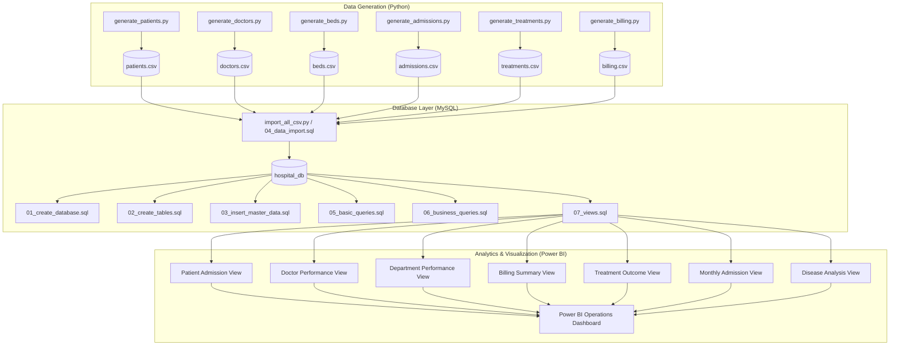
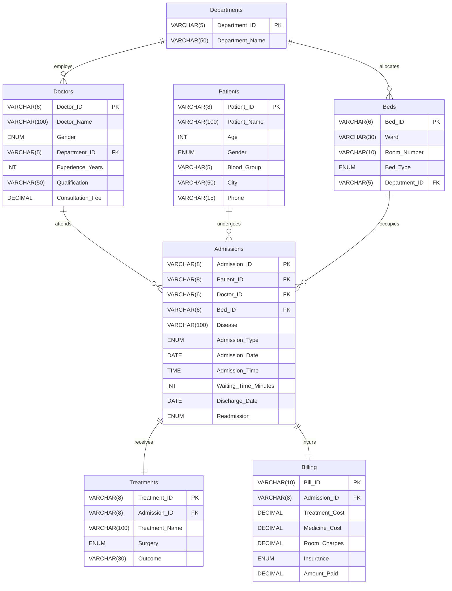

# 🏥 Hospital Operations Intelligence Dashboard

An enterprise-grade healthcare operations and clinical intelligence analytics system built using **Python**, **MySQL**, and **Power BI**. This platform provides end-to-end visibility into hospital capacity, physician productivity, emergency triage efficiency, clinical outcomes, and revenue cycle management.

---

## 📌 Table of Contents
- [Executive Overview](#-executive-overview)
- [Key Features & Capabilities](#-key-features--capabilities)
- [System Architecture](#-system-architecture)
- [Entity-Relationship Diagram](#-entity-relationship-diagram)
- [Repository Structure](#-repository-structure)
- [Tech Stack](#-tech-stack)
- [Data Pipeline & Synthetic Engine](#-data-pipeline--synthetic-engine)
- [Installation & Quick Start](#-installation--quick-start)
  - [1. Environment Setup](#1-environment-setup)
  - [2. Synthetic Data Generation](#2-synthetic-data-generation)
  - [3. MySQL Database Setup](#3-mysql-database-setup)
  - [4. Data Ingestion](#4-data-ingestion)
  - [5. Analytical Queries & Views](#5-analytical-queries--views)
  - [6. Power BI Dashboard Integration](#6-power-bi-dashboard-integration)
- [SQL Business Inquiries & Analytics](#-sql-business-inquiries--analytics)
- [Power BI DAX Measures](#-power-bi-dax-measures)
- [Business Requirements](#-business-requirements)
- [License & Author](#-license--author)

---

## 🌟 Executive Overview

Hospital management involves synchronizing patient admissions, clinical workflows, bed allocations, physician schedules, and billing cycles. Without centralized intelligence, hospitals experience prolonged wait times, sub-optimal bed turnover, high readmission rates, and revenue leakage.

The **Hospital Operations Intelligence Dashboard** models an enterprise hospital network spanning:
- **10 Specialized Departments** (Cardiology, Neurology, Oncology, Emergency, ICU, etc.)
- **80 Medical Consultants & Surgeons**
- **300 Hospital Beds** across 10 Wards
- **15,000 Patient Records** across 15 Regional Cities
- **15,000 Admission & Triage Events** (2024–2025)
- **15,000 Clinical Treatments & Surgeries**
- **15,000 Billing & Insurance Transactions**

---

## 🚀 Key Features & Capabilities

- **Real-Time Capacity & Bed Tracking:** Ward-level bed occupancy metrics across General, Semi-Private, Private, and ICU beds.
- **Emergency Triage Optimization:** Monitoring waiting times across Emergency, Inpatient, and Outpatient triage channels.
- **Clinical Efficacy & Outcome Analytics:** Tracking surgery volumes, treatment recovery rates (70%+ target), and post-discharge readmissions (<10%).
- **Physician Performance & Workload:** Evaluating doctor caseloads, surgical interventions, and revenue generation vs. years of experience.
- **Financial & Revenue Cycle Intelligence:** Cost breakdown across treatment tariffs, pharmaceutical charges, room fees, insurance discounts (80% insured coverage), and out-of-pocket co-pays.
- **Demographic & Geographic Intelligence:** Patient distribution across Tamil Nadu urban centers, age cohorts, and blood groups for emergency preparedness.

---

## 🏗 System Architecture



---

## 📊 Entity-Relationship Diagram



---

## 📁 Repository Structure

```
Hospital-Operations-Intelligence-Dashboard/
│
├── data/                               # Generated CSV Datasets (15,000+ records)
│   ├── admissions.csv                  # Patient admissions, triage, dates, and stay
│   ├── beds.csv                        # Ward beds, room numbers, and bed types
│   ├── billing.csv                     # Incurred costs, insurance, and amount paid
│   ├── doctors.csv                     # Doctor profiles, qualifications, and fees
│   ├── patients.csv                    # Patient demographic and contact index
│   └── treatments.csv                  # Clinical treatments, surgeries, and outcomes
│
├── docs/                               # Project Documentation
│   └── Business_Requirements.md        # Comprehensive Business Requirements Document (BRD)
│
├── powerbi/                            # Power BI Assets, DAX Measures & Report Guide
│   ├── DAX_Measures.dax                # Production DAX measures for Power BI metrics
│   └── PowerBI_Report_Guide.md         # Step-by-step visual, model & page building guide
├── python/                             # Python Data Generation & ETL Scripts
│   ├── generate_patients.py            # Generates 15,000 patient records
│   ├── generate_doctors.py             # Generates 80 doctor profiles across 10 specialties
│   ├── generate_beds.py                # Generates 300 bed inventory records
│   ├── generate_admissions.py          # Generates 15,000 realistic admission events
│   ├── generate_treatments.py          # Generates 15,000 treatment & outcome records
│   ├── generate_billing.py             # Generates 15,000 billing & insurance transactions
│   ├── import_csv_to_mysql.py          # Single-table doctor data importer
│   └── import_all_csv.py               # Complete multi-table automated MySQL loader
│
├── screenshots/                        # Dashboard Visualizations & Reports
│
├── sql/                                # Database Creation, Queries & Analytics
│   ├── 01_create_database.sql          # Schema initialization (hospital_db)
│   ├── 02_create_tables.sql            # Table DDL with PK/FK constraints
│   ├── 03_insert_master_data.sql       # Seeds 10 medical departments
│   ├── 04_data_import.sql              # MySQL LOAD DATA INFILE script
│   ├── 05_basic_queries.sql            # Table verification, sample checks & sanity counts
│   ├── 06_business_queries.sql         # 20 core operational business queries
│   └── 07_views.sql                    # 7 operational reporting database views
│
├── .gitignore                          # Git ignore rules
├── LICENSE                             # MIT License
├── README.md                           # Master Project Documentation
└── requirements.txt                    # Python environment dependencies
```

---

## 💻 Tech Stack

| Component | Technology | Version / Description |
| :--- | :--- | :--- |
| **Data Generation & ETL** | Python | 3.10+ (`pandas`, `numpy`, `faker`, `mysql-connector-python`) |
| **Relational Database** | MySQL Server | 8.0+ (Strict foreign keys, views, and indexes) |
| **Business Intelligence** | Microsoft Power BI | Interactive dashboards, Star-schema model, DAX measures |
| **Version Control** | Git & GitHub | Modular directory structure and documentation |

---

## ⚙️ Installation & Quick Start

### 1. Environment Setup

Clone the repository and install required Python packages:

```bash
# Navigate to project root
cd Hospital-Operations-Intelligence-Dashboard

# Install Python dependencies
pip install -r requirements.txt
```

### 2. Synthetic Data Generation

Run the generation scripts to produce reproducible, referentially consistent CSV datasets in the `data/` directory:

```bash
python python/generate_patients.py
python python/generate_doctors.py
python python/generate_beds.py
python python/generate_admissions.py
python python/generate_treatments.py
python python/generate_billing.py
```

### 3. MySQL Database Setup

Log into MySQL client/workbench and execute the initialization scripts in order:

```sql
-- 1. Create database
SOURCE sql/01_create_database.sql;

-- 2. Create tables with foreign key constraints
SOURCE sql/02_create_tables.sql;

-- 3. Populate master departments
SOURCE sql/03_insert_master_data.sql;
```

### 4. Data Ingestion

You can import all generated CSV datasets into MySQL using either method:

#### Method A: Python Automated Importer (Recommended)
Configure your MySQL credentials in [python/import_all_csv.py](file:///c:/Users/ARAVIND/OneDrive/Desktop/Hospital-Operations-Intelligence-Dashboard/python/import_all_csv.py) and execute:
```bash
python python/import_all_csv.py
```

#### Method B: Pure SQL Bulk Loader
Execute [sql/04_data_import.sql](file:///c:/Users/ARAVIND/OneDrive/Desktop/Hospital-Operations-Intelligence-Dashboard/sql/04_data_import.sql) in MySQL:
```sql
SOURCE sql/04_data_import.sql;
```

### 5. Analytical Queries & Views

Execute the basic checks, 20 business queries, and 7 reporting views:

```sql
-- Run sanity checks and record counts
SOURCE sql/05_basic_queries.sql;

-- Run 20 core business analytical queries
SOURCE sql/06_business_queries.sql;

-- Create 7 operational database views
SOURCE sql/07_views.sql;
```

### 6. Power BI Dashboard Integration

1. Open **Microsoft Power BI Desktop**.
2. Connect to MySQL Database (`localhost / hospital_db`) or import the CSV files directly from `data/`.
3. Ingest the 7 database views:
   - `patient_admission_view`
   - `doctor_performance_view`
   - `department_performance_view`
   - `billing_summary_view`
   - `treatment_outcome_view`
   - `monthly_admission_view`
   - `disease_analysis_view`
4. Add the DAX measures detailed below and build the interactive report pages.

---

## 📈 SQL Business Inquiries & Analytics

The repository includes 20 production SQL queries solving key healthcare operational inquiries:

1. **Department-wise Patient Count:** Specialty volume and workload ranking.
2. **Department-wise Revenue:** Total revenue generated across medical specialties.
3. **Top 10 Highest Revenue Doctors:** Physician financial contribution leaderboard.
4. **Average Patient Age:** Overall patient demographic profile.
5. **Gender Distribution:** Analysis of male vs. female admission trends.
6. **Blood Group Distribution:** Patient blood inventory planning.
7. **Most Common Treatment:** Procedure frequency and consumable demands.
8. **Treatment Success Rate:** Outcome metrics (Recovered, Improved, Referred, Deceased).
9. **Average Treatment Cost:** Baseline tariff analysis.
10. **Insurance Usage Analysis:** Proportion of insured (65%) vs self-pay (35%) patients.
11. **Total Hospital Revenue:** Aggregate hospital collections.
12. **Average Length of Stay (ALOS):** Inpatient turnover and bed utilization index.
13. **Readmission Analysis:** 30-day post-discharge readmission rates.
14. **Average Waiting Time Department Wise:** Triage delays across specialties.
15. **Monthly Admission Trend:** Seasonal surge and volume fluctuations.
16. **City-wise Patient Count:** Regional patient catchment areas.
17. **Doctor Experience vs. Revenue:** Seniority vs billing realization.
18. **Most Occupied Bed Types:** General vs ICU vs Private bed distribution.
19. **Emergency Department Load:** Rapid-response case volume.
20. **Highest Billing Patients:** Top 10 high-value cases.

---

## 📐 Power BI DAX Measures

```dax
-- Total Admissions
Total Admissions = COUNTROWS('Admissions')

-- Total Revenue
Total Revenue = SUM('Billing'[Amount_Paid])

-- Average Length of Stay (Days)
Average Length of Stay = 
AVERAGEX(
    'Admissions',
    DATEDIFF('Admissions'[Admission_Date], 'Admissions'[Discharge_Date], DAY)
)

-- Average Waiting Time (Minutes)
Average Wait Time = AVERAGE('Admissions'[Waiting_Time_Minutes])

-- Readmission Rate (%)
Readmission Rate = 
DIVIDE(
    CALCULATE(COUNTROWS('Admissions'), 'Admissions'[Readmission] = "Yes"),
    COUNTROWS('Admissions'),
    0
)

-- Recovery Rate (%)
Recovery Rate = 
DIVIDE(
    CALCULATE(COUNTROWS('Treatments'), 'Treatments'[Outcome] = "Recovered"),
    COUNTROWS('Treatments'),
    0
)

-- Insurance Penetration (%)
Insurance Ratio = 
DIVIDE(
    CALCULATE(COUNTROWS('Billing'), 'Billing'[Insurance] = "Yes"),
    COUNTROWS('Billing'),
    0
)
```

---

## 📖 Business Requirements

For full specifications, user personas, KPI formulas, and reporting wireframes, see [docs/Business_Requirements.md](file:///c:/Users/ARAVIND/OneDrive/Desktop/Hospital-Operations-Intelligence-Dashboard/docs/Business_Requirements.md).

---

## 📄 License & Author

- **Author:** Aravind Thirumalai
- **License:** MIT License — see [LICENSE](file:///c:/Users/ARAVIND/OneDrive/Desktop/Hospital-Operations-Intelligence-Dashboard/LICENSE) for details.
