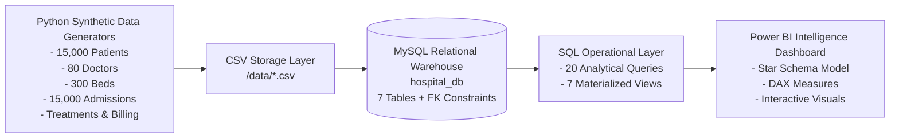
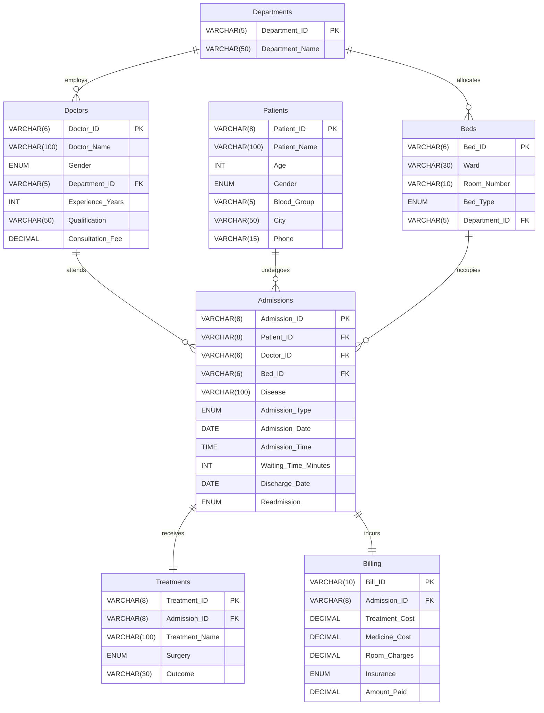

# Business Requirements Document (BRD)
## Hospital Operations Intelligence Dashboard

---

### Document Overview
- **Project Name:** Hospital Operations Intelligence Dashboard
- **Document Version:** 1.0.0
- **Author:** Aravind Thirumalai
- **Domain:** Healthcare Analytics & Hospital Operations Management
- **Target Audience:** Hospital Leadership, Chief Medical Officers (CMO), Operations Directors, Financial Controllers, Power BI Developers, Data Engineers

---

## 1. Executive Summary

Healthcare organizations manage complex daily operations involving patient triage, bed assignments, clinical interventions, physician scheduling, and financial processing. Without centralized data intelligence, hospitals suffer from operational bottlenecks, prolonged emergency wait times, sub-optimal bed utilization, uncoordinated billing cycles, and preventable readmissions.

The **Hospital Operations Intelligence Dashboard** is an enterprise analytics solution designed to provide near real-time operational visibility across 10 specialized departments, 80 physicians, 300 hospital beds, and 15,000+ patient admissions. By integrating data across clinical, operational, and financial dimensions into a unified MySQL relational warehouse and surfacing insights via Power BI dashboards, the system empowers healthcare executives and department heads to optimize resource allocation, enhance clinical outcomes, and maximize revenue efficiency.

---

## 2. Business Problem Statement

Hospital administrators and department heads currently face critical operational challenges:

1. **Inpatient Capacity & Bed Allocation Bottlenecks:** Lack of visibility into ward-level bed occupancy leads to delays in emergency-to-inpatient transitions and ICU bed shortages.
2. **Emergency Department Triage Delays:** Extended patient wait times in Emergency and Outpatient departments negatively impact patient experience and clinical outcomes.
3. **Revenue Leakage & Billing Discrepancies:** Variations in insurance coverage (averaging 65% utilization), treatment markups, room charges, and out-of-pocket patient co-pays create cash flow unpredictability.
4. **Clinical Outcome Disparities:** Inconsistent tracking of surgery outcomes, recovery rates, and post-discharge readmission rates (target < 12%) impedes quality assurance.
5. **Physician Workload Imbalance:** Uneven distribution of patient admissions and revenue generation across physicians with varying experience levels.

---

## 3. Core Business Objectives & Target KPIs

| Objective | Business Goal | Target KPI Metric | Baseline / Target |
| :--- | :--- | :--- | :--- |
| **Capacity Management** | Maximize bed utilization across wards while preventing ICU saturation | Bed Occupancy Rate | 75% - 85% Target |
| **Throughput Optimization** | Reduce inpatient duration without compromising recovery quality | Average Length of Stay (ALOS) | < 4.0 Days |
| **Triage Efficiency** | Minimize patient waiting time from check-in to physician consultation | Average Waiting Time | < 25 Minutes |
| **Quality of Care** | Minimize 30-day post-discharge readmission incidents | Readmission Rate | < 10.0% |
| **Clinical Efficacy** | Ensure high clinical success and recovery rates across all departments | Treatment Recovery Rate | > 70.0% |
| **Financial Health** | Optimize department revenue recovery and monitor insurance settlement | Total Hospital Revenue | Track & Forecast |

---

## 4. Stakeholder Analysis & User Personas

```
+-----------------------------------------------------------------------------------+
|                        HOSPITAL LEADERSHIP STAKEHOLDERS                           |
+-----------------------------------------------------------------------------------+
|  1. Chief Executive / Operations Officer (CEO/COO)                                 |
|     - Focus: Total Admissions, Overall Bed Occupancy, Hospital Revenue, ALOS      |
+-----------------------------------------------------------------------------------+
|  2. Chief Medical Officer (CMO) & Clinical Quality Leads                          |
|     - Focus: Treatment Recovery Rates, Surgery Counts, Mortality/Referral Rates   |
+-----------------------------------------------------------------------------------+
|  3. Department Heads & Clinical Directors (10 Departments)                        |
|     - Focus: Physician Workloads, Department Revenue, Case Volume, Waiting Times  |
+-----------------------------------------------------------------------------------+
|  4. Inpatient & Nursing Bed Managers                                              |
|     - Focus: Bed Availability, Ward Turnaround, Room Utilization (ICU vs General) |
+-----------------------------------------------------------------------------------+
|  5. Chief Financial Officer (CFO) & Billing Administrators                        |
|     - Focus: Treatment vs Medicine vs Room Revenue, Insurance vs Cash Breakdown   |
+-----------------------------------------------------------------------------------+
```

---

## 5. System Architecture & End-to-End Pipeline

The analytics solution operates through a 4-tier data pipeline:



1. **Synthetic Data Engine (Python 3.10+):** `pandas` and statistical distribution generators create realistic, referentially intact records modeling Tamil Nadu healthcare demographics.
2. **Data Storage & RDBMS (MySQL 8.0+):** High-integrity relational schema with strict foreign keys, indices, and check constraints across 7 normalized entities.
3. **Analytical Query Layer (SQL):** Standardized basic checks, 20 business-critical queries, and 7 optimized database views for operational reporting.
4. **Business Intelligence Layer (Power BI):** Interactive multi-page executive dashboards connected to MySQL views or direct CSV models.

---

## 6. Entity-Relationship Data Model



---

## 7. Data Dictionary & Business Logic

### 7.1 Table: `Departments`
Master registry of hospital medical and surgical specialties.
- **Record Count:** 10 Departments
- **Keys:** `Department_ID` (Primary Key, e.g., 'D001')
- **Attributes:**
  - `Department_ID` (VARCHAR 5, PK): Unique identifier.
  - `Department_Name` (VARCHAR 50, NOT NULL): Cardiology, Neurology, Orthopedics, Pediatrics, Oncology, ENT, Dermatology, Emergency, ICU, General Medicine.

### 7.2 Table: `Doctors`
Physicians and medical consultants across hospital departments.
- **Record Count:** 80 Doctors (6 to 10 doctors per department)
- **Keys:** `Doctor_ID` (PK, e.g., 'DR001'), `Department_ID` (FK -> `Departments`)
- **Attributes:**
  - `Doctor_Name` (VARCHAR 100): Full name with 'Dr.' prefix.
  - `Gender` (ENUM: 'Male', 'Female'): Gender identity.
  - `Experience_Years` (INT): Ranging from 2 to 30 years.
  - `Qualification` (VARCHAR 50): Specialist medical degree (e.g., MD Cardiology, DM Oncology, MS Orthopedics).
  - `Consultation_Fee` (DECIMAL 10,2): Scaled by experience tier (INR 500 to 1,800).

### 7.3 Table: `Patients`
Master patient index across Tamil Nadu demographic centers.
- **Record Count:** 15,000 Unique Patients
- **Keys:** `Patient_ID` (PK, e.g., 'P00001')
- **Attributes:**
  - `Patient_Name` (VARCHAR 100): First and Last Name.
  - `Age` (INT): 1 to 90 years (modeled across Child, Young, Adult, Senior, Old distributions).
  - `Gender` (ENUM: 'Male', 'Female').
  - `Blood_Group` (VARCHAR 5): O+, A+, B+, AB+, O-, A-, B-, AB- with standard biological population weights.
  - `City` (VARCHAR 50): Chennai, Coimbatore, Madurai, Trichy, Salem, Vellore, Tirunelveli, Tiruppur, Erode, Kanchipuram, Thanjavur, Dindigul, Hosur, Tiruvallur, Tiruttani.
  - `Phone` (VARCHAR 15): Indian 10-digit mobile phone contact.

### 7.4 Table: `Beds`
Hospital inpatient capacity and ward inventory.
- **Record Count:** 300 Physical Beds
- **Keys:** `Bed_ID` (PK, e.g., 'B001'), `Department_ID` (FK -> `Departments`)
- **Attributes:**
  - `Ward` (VARCHAR 30): Ward A through H, Emergency Ward, ICU.
  - `Room_Number` (VARCHAR 10): E.g., 'R101' (2 beds/room), 'ICU101' (1 bed/room).
  - `Bed_Type` (ENUM): 'General' (70%), 'Semi-Private' (20%), 'Private' (10%), 'ICU' (dedicated).

### 7.5 Table: `Admissions`
Transactional records of hospital admissions and triage.
- **Record Count:** 15,000 Admission Events (Jan 1, 2024 to Dec 31, 2025)
- **Keys:** `Admission_ID` (PK, e.g., 'A00001'), `Patient_ID` (FK), `Doctor_ID` (FK), `Bed_ID` (FK)
- **Attributes:**
  - `Disease` (VARCHAR 100): Department-mapped clinical condition (e.g., Heart Attack, Stroke, Fracture, Diabetes).
  - `Admission_Type` (ENUM): 'Emergency' (25%), 'Inpatient' (45%), 'Outpatient' (30%).
  - `Admission_Date` (DATE) & `Admission_Time` (TIME).
  - `Waiting_Time_Minutes` (INT):
    - Emergency: 5 - 30 minutes
    - Inpatient: 20 - 90 minutes
    - Outpatient: 10 - 60 minutes
  - `Discharge_Date` (DATE): Calculated as `Admission_Date + Length_of_Stay`.
    - Length of Stay: Emergency (1-3 days), Inpatient (2-10 days), Outpatient (0 days).
  - `Readmission` (ENUM: 'Yes' (10%), 'No' (90%)): 30-day unplanned readmission flag.

### 7.6 Table: `Treatments`
Medical procedures, therapies, and clinical outcomes.
- **Record Count:** 15,000 Treatment Records
- **Keys:** `Treatment_ID` (PK, e.g., 'T00001'), `Admission_ID` (FK)
- **Attributes:**
  - `Treatment_Name` (VARCHAR 100): E.g., Angioplasty, Bypass Surgery, Chemotherapy, Dialysis, Knee Replacement, MRI Brain, Ventilator Support.
  - `Surgery` (ENUM: 'Yes', 'No'): Procedure classification.
  - `Outcome` (VARCHAR 30): 'Recovered' (70%), 'Improved' (20%), 'Referred' (7%), 'Deceased' (3%).

### 7.7 Table: `Billing`
Financial transaction details, cost breakdowns, and co-payments.
- **Record Count:** 15,000 Billing Records
- **Keys:** `Bill_ID` (PK, e.g., 'BILL00001'), `Admission_ID` (FK)
- **Attributes:**
  - `Treatment_Cost` (DECIMAL 10,2): Fixed standard tariff per procedure (INR 800 for ECG up to INR 450,000 for Bypass Surgery).
  - `Medicine_Cost` (DECIMAL 10,2): Variable pharmaceuticals (INR 500 - 20,000).
  - `Room_Charges` (DECIMAL 10,2): `Room_Rate_Per_Day (INR 2,000 - 5,000) * Length_of_Stay`.
  - `Insurance` (ENUM: 'Yes' (65%), 'No' (35%)): Insurance policy coverage status.
  - `Amount_Paid` (DECIMAL 10,2):
    - Insured Patients: 20% patient co-payment (`Total_Bill * 0.20`)
    - Uninsured Patients: 100% self-pay (`Total_Bill`)

---

## 8. Analytical & Business Query Matrix

The 20 strategic SQL queries solve specific operational and financial inquiries:

| Query # | Analytical Inquest | Business Impact | Primary Entity / View |
| :---: | :--- | :--- | :--- |
| **01** | Department-wise Patient Count | Identifies high-demand departments for staff allocation | `Admissions`, `Doctors`, `Departments` |
| **02** | Department-wise Revenue | Assesses specialty profitability and investment ROI | `Billing`, `Admissions`, `Departments` |
| **03** | Top 10 Highest Revenue Doctors | Identifies top clinical contributors for leadership recognition | `Billing`, `Doctors`, `Departments` |
| **04** | Average Patient Age | Informs clinical programs tailored to elderly vs pediatric needs | `Patients` |
| **05** | Gender Distribution | Ensures equitable healthcare access and targeted health initiatives | `Patients` |
| **06** | Blood Group Distribution | Manages blood bank reserve thresholds and emergency stockpiles | `Patients` |
| **07** | Most Common Treatment | Optimizes medical consumable inventory and equipment maintenance | `Treatments` |
| **08** | Treatment Success Rate | Monitors clinical quality, recovery standards, and mortality risks | `Treatments` |
| **09** | Average Treatment Cost | Calibrates pricing benchmarks and insurance reimbursement rates | `Billing` |
| **10** | Insurance Usage Analysis | Guides payer negotiations and cashless hospitalization workflows | `Billing` |
| **11** | Total Hospital Revenue | Measures overall fiscal health and budget realization | `Billing` |
| **12** | Average Length of Stay (ALOS) | Evaluates inpatient turnover efficiency and bed utilization | `Admissions` |
| **13** | Readmission Analysis | Flags post-acute care gaps and quality audit triggers | `Admissions` |
| **14** | Departmental Waiting Time | Detects triage bottlenecks and staffing shortages | `Admissions`, `Departments` |
| **15** | Monthly Admission Trend | Identifies seasonal surges (monsoon fevers, winter ailments) | `Admissions` |
| **16** | City-wise Patient Origin | Informs outreach clinics, ambulance networks, and regional marketing | `Patients` |
| **17** | Doctor Experience vs Revenue | Analyzes correlation between seniority, caseload, and billing | `Doctors`, `Billing` |
| **18** | Bed Type Distribution | Optimizes bed mix (General vs Semi-Private vs ICU) | `Beds` |
| **19** | Emergency Department Load | Plans rapid-response capacity and critical trauma staffing | `Admissions`, `Departments` |
| **20** | Top 10 High-Billing Patients | Supports complex case management and credit review | `Billing`, `Admissions` |

---

## 9. Power BI Dashboard Specifications

The business intelligence suite is organized into 5 specialized interactive reporting pages:

### Page 1: Executive Overview & Operational KPIs
- **Key Metrics (Cards):** Total Admissions (15,000), Total Revenue (INR), Average Length of Stay (Days), Overall Readmission Rate (%), Average Triage Wait Time (Mins).
- **Visualizations:**
  - Monthly Admission & Revenue Trend (Combo Line & Clustered Column Chart).
  - Admission Type Breakdown (Emergency vs Inpatient vs Outpatient Donut Chart).
  - Departmental Volume & Revenue Distribution (Bar Chart).
  - Slicers: Year (2024, 2025), Department, Admission Type.

### Page 2: Department & Doctor Performance
- **Visualizations:**
  - Doctor Revenue Leaderboard (Horizontal Bar Chart with Experience Tag).
  - Departmental Patient Volume vs Average Wait Time (Scatter / Bubble Plot).
  - Consultation Fee & Seniority Distribution Matrix.
  - Doctor Workload Table (Doctor Name, Department, Patients Treated, Total Surgeries, Revenue Generated).
  - Slicers: Department Name, Doctor Qualification, Gender.

### Page 3: Bed & Inpatient Capacity Management
- **Visualizations:**
  - Bed Inventory by Ward & Bed Type (Stacked Column Chart).
  - Bed Type Occupancy & Turnover Index (Gauge Chart).
  - Average Length of Stay by Disease & Specialty (Heatmap / Matrix).
  - Inpatient Admission Volume vs Length of Stay Distribution (Histogram).
  - Slicers: Ward, Bed Type, Admission Type.

### Page 4: Financial & Billing Intelligence
- **Visualizations:**
  - Cost Breakdown Structure: Treatment Cost vs Medicine Cost vs Room Charges (100% Stacked Bar).
  - Insurance Penetration Ratio (65% Insured vs 35% Self-Pay Donut Chart).
  - Out-of-Pocket Co-Payment vs Total Incurred Charges (Area Chart).
  - Top 10 High-Cost Treatments & Revenue Recovery Matrix.
  - Slicers: Insurance (Yes/No), Disease Category, Month/Quarter.

### Page 5: Clinical Outcomes & Patient Demographics
- **Visualizations:**
  - Treatment Outcomes (Recovered, Improved, Referred, Deceased Funnel / Donut).
  - Surgery vs Non-Surgical Clinical Outcomes (Clustered Bar Chart).
  - Geographic Patient Distribution across Tamil Nadu Cities (Filled Map / Treemap).
  - Patient Age Cohort & Blood Group Distribution (Pyramid / Bar Chart).
  - Readmission Rate by Disease & Treatment Type (Bar Chart with Benchmark Line).
  - Slicers: Outcome, Blood Group, Age Group, City.

---

## 10. DAX Measures Reference for Power BI

```dax
-- Total Admissions
Total Admissions = COUNTROWS('Admissions')

-- Total Revenue (Amount Paid)
Total Revenue = SUM('Billing'[Amount_Paid])

-- Total Incurred Bill (Gross)
Total Gross Bill = SUM('Billing'[Treatment_Cost]) + SUM('Billing'[Medicine_Cost]) + SUM('Billing'[Room_Charges])

-- Average Length of Stay (ALOS in Days)
Average Length of Stay = 
AVERAGEX(
    'Admissions',
    DATEDIFF('Admissions'[Admission_Date], 'Admissions'[Discharge_Date], DAY)
)

-- Average Waiting Time (Minutes)
Average Wait Time = AVERAGE('Admissions'[Waiting_Time_Minutes])

-- Readmission Rate (%)
Readmission Rate = 
DIVIDE(
    CALCULATE(COUNTROWS('Admissions'), 'Admissions'[Readmission] = "Yes"),
    COUNTROWS('Admissions'),
    0
)

-- Treatment Recovery Rate (%)
Recovery Rate = 
DIVIDE(
    CALCULATE(COUNTROWS('Treatments'), 'Treatments'[Outcome] = "Recovered"),
    COUNTROWS('Treatments'),
    0
)

-- Surgery Percentage (%)
Surgery Rate = 
DIVIDE(
    CALCULATE(COUNTROWS('Treatments'), 'Treatments'[Surgery] = "Yes"),
    COUNTROWS('Treatments'),
    0
)

-- Insurance Coverage Ratio (%)
Insurance Penetration = 
DIVIDE(
    CALCULATE(COUNTROWS('Billing'), 'Billing'[Insurance] = "Yes"),
    COUNTROWS('Billing'),
    0
)
```

---

## 11. Data Governance, Quality, and Security

1. **Patient Confidentiality & HIPAA Compliance:** All patient names, contact numbers, and identifiers in the dataset are synthetic and anonymized for development and analytics demonstration.
2. **Referential Integrity:** Enforced via MySQL Foreign Keys (`ON DELETE RESTRICT`) across all transactional entities.
3. **Data Quality Checks:** 
   - No negative charges or consultation fees.
   - `Discharge_Date >= Admission_Date`.
   - Valid enumerated categories for `Admission_Type`, `Bed_Type`, `Surgery`, `Outcome`, `Insurance`, `Readmission`, and `Blood_Group`.
4. **Role-Based Access Control (RBAC):**
   - Executive Tier: Full access to all financial, clinical, and capacity reports.
   - Clinical Tier: Access to patient outcomes, admissions, bed availability; restricted financial data.
   - Billing Tier: Access to billing summaries, insurance claims, and revenue audit views.
